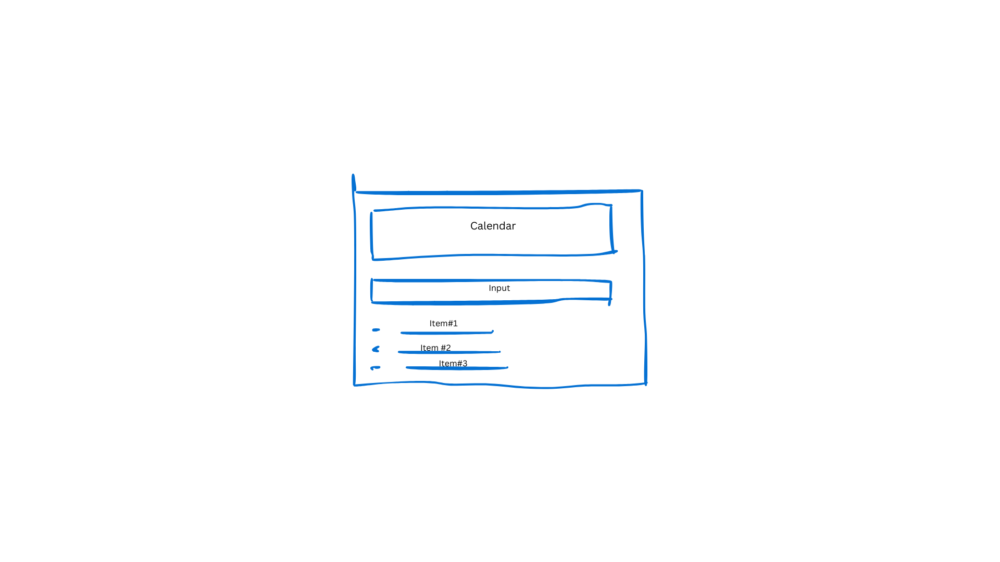

# Тестовое задание для Front-End разработчика

## Описание задачи

Создайте одностраничное веб-приложение **"ToDo Calendar"** для управления списком задач с привязкой к датам. Приложение должно позволять пользователям добавлять задачи на определенные даты, отображать задачи в календаре и показывать количество задач на каждый день. Используйте предоставленный mock сервер с документацией Swagger для взаимодействия с сервером.



## Требования

### Функциональность

- [ ] **Календарь:**
  - Отображение календаря на странице приложения.
  - В календаре отображается количество задач для каждого дня. (http://localhost:4000/calendar)
  - При клике на дату отображается список задач, запланированных на эту дату. (http://localhost:4000/tasks?date=YYYY-MM-DD)

- [ ] **Добавление задач:**
  - Форма для добавления новой задачи с полями:
    - **Название задачи** (обязательное поле)
    - **Дата выполнения** (обязательное поле)
  - Валидация формы перед отправкой.

- [ ] **Отображение списка задач:**
  - Список задач на выбранную дату.
  - Возможность пометить задачу как выполненную.
  - Возможность удалить задачу из списка.
  
- [ ] **Работа с API:**
  - Получение и отправка данных через предоставленный mock сервер с использованием **Axios**.
  - Интеграция с API согласно документации Swagger.
  - Реализация следующих запросов к серверу:
    - **GET /tasks?date=YYYY-MM-DD**: Получить задачи на определенную дату.
    - **GET /calendar**: Получить количество задач на каждый день месяца.
    - **POST /tasks**: Создать новую задачу с указанием названия и даты.
  - Обработка ошибок при запросах и отображение понятных сообщений пользователю.

### Дополнительные требования

- [ ] **TypeScript:** Использование **TypeScript** для типизации кода.
- [ ] **Линтинг и форматирование:** Настройка **ESLint** и **Prettier** для поддержания качества кода.
- [ ] **Контроль версий:** Использование **Git** с осмысленными коммитами.

## Инструкция по запуску

### 1. Установка зависимостей

В корневой папке:

```bash
npm install
```

### 2. Запуск mock сервера

```bash
npm run start:server
```

Mock сервер будет доступен по адресу `http://localhost:4000`.  
Документация API доступна по адресу `http://localhost:4000/api-docs`.

### 3. Разработка клиентского приложения

В папке `client`:

```bash
cd client
npm init
npm install
npm start
```


## Как предоставить решение

1. **Репозиторий:**
    - Разместите код репозитории на **GitHub** или **GitLab**.
    - Предоставьте доступ к репозиторию (укажите необходимые контактные данные).

2. **client/README.md:**
    - Добавьте инструкции по установке и запуску проекта.
    - Опишите использованные технологии и любые особые решения, которые вы приняли.

## Критерии оценки

- **Функциональность:** Полнота реализации всех указанных требований.
- **Качество кода:** Чистота, структура, использование **TypeScript**.
- **Документация:** Наличие файла **README.md** с инструкциями по запуску и описанием проекта.
- **Git:** Чистая история коммитов с понятными сообщениями.

## Срок выполнения

- **1 вечер** (ориентировочно 3-4 часа).

## Дополнительная информация

- **Mock сервер:**
    - Документация Swagger доступна по адресу `http://localhost:4000/api-docs`.
    - Сервер поддерживает следующие операции:
        - **GET /tasks?date=YYYY-MM-DD**: Получить задачи на определенную дату.
        - **GET /calendar**: Получить количество задач на каждый день месяца.
        - **POST /tasks**: Создать новую задачу с указанием названия и даты.

- **Рекомендации:**
    - Сосредоточьтесь на реализации основных функций, а не на количестве дополнительных.
    - Обратите внимание на обработку ошибок и отображение сообщений пользователю.
    - Используйте функциональные компоненты и хуки React.
    - Придерживайтесь лучших практик разработки.

- **Связь:**
    - В случае вопросов свяжитесь с нами по электронной почте (msagyndyk@gmail.com).

# ***Желаем удачи!***
